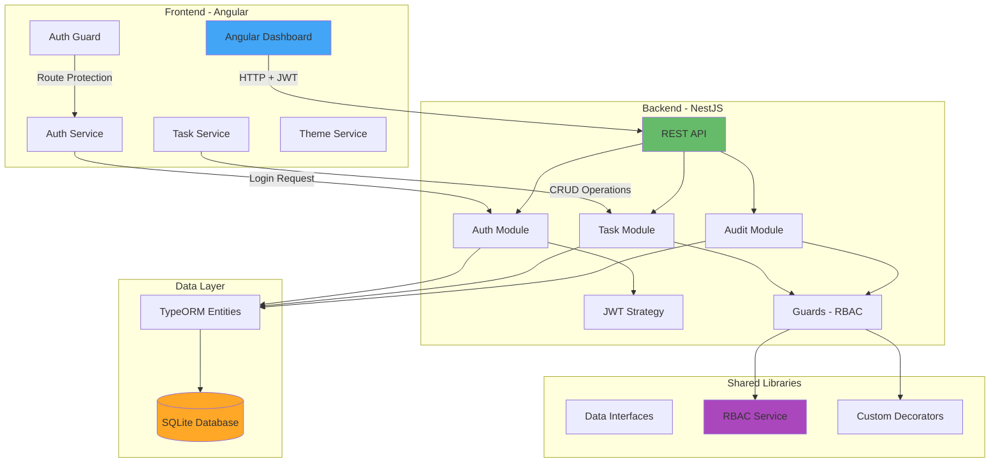
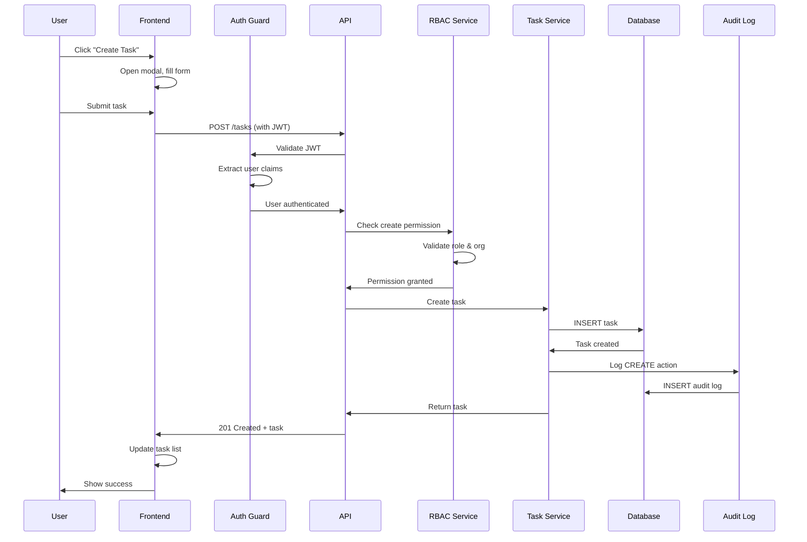
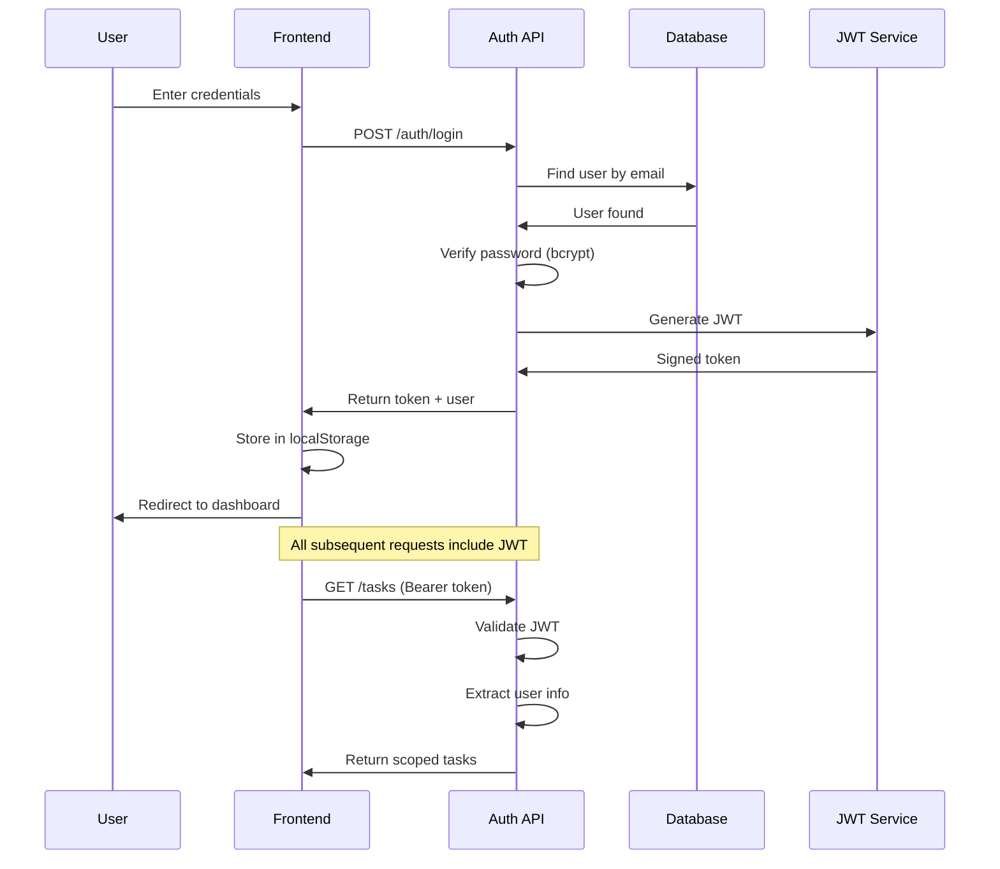
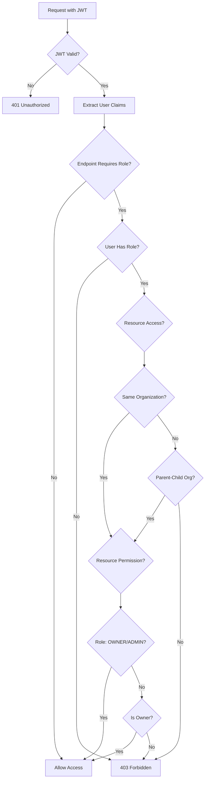

# System Architecture Diagram

## High-Level Architecture

```mermaid
graph TB
    subgraph "Frontend - Angular"
        UI[Angular Dashboard]
        Auth[Auth Service]
        Task[Task Service]
        Theme[Theme Service]
        Guard[Auth Guard]
    end
    
    subgraph "Backend - NestJS"
        API[REST API]
        AuthModule[Auth Module]
        TaskModule[Task Module]
        AuditModule[Audit Module]
        JWT[JWT Strategy]
        Guards[Guards - RBAC]
    end
    
    subgraph "Shared Libraries"
        Interfaces[Data Interfaces]
        RBAC[RBAC Service]
        Decorators[Custom Decorators]
    end
    
    subgraph "Data Layer"
        DB[(SQLite Database)]
        Entities[TypeORM Entities]
    end
    
    UI -->|HTTP + JWT| API
    Auth -->|Login Request| AuthModule
    Task -->|CRUD Operations| TaskModule
    Guard -->|Route Protection| Auth
    
    API --> AuthModule
    API --> TaskModule
    API --> AuditModule
    
    AuthModule --> JWT
    AuthModule --> Entities
    TaskModule --> Guards
    TaskModule --> Entities
    AuditModule --> Guards
    AuditModule --> Entities
    
    Guards --> RBAC
    Guards --> Decorators
    
    Entities --> DB
    
    style UI fill:#42a5f5
    style API fill:#66bb6a
    style DB fill:#ffa726
    style RBAC fill:#ab47bc
```

## Data Flow - Create Task

```mermaid
sequenceDiagram
    participant U as User
    participant F as Frontend
    participant G as Auth Guard
    participant A as API
    participant R as RBAC Service
    participant T as Task Service
    participant D as Database
    participant L as Audit Log
    
    U->>F: Click "Create Task"
    F->>F: Open modal, fill form
    U->>F: Submit task
    F->>A: POST /tasks (with JWT)
    A->>G: Validate JWT
    G->>G: Extract user claims
    G->>A: User authenticated
    A->>R: Check create permission
    R->>R: Validate role & org
    R->>A: Permission granted
    A->>T: Create task
    T->>D: INSERT task
    D->>T: Task created
    T->>L: Log CREATE action
    L->>D: INSERT audit log
    T->>A: Return task
    A->>F: 201 Created + task
    F->>F: Update task list
    F->>U: Show success
```

## Authentication Flow

```mermaid
sequenceDiagram
    participant U as User
    participant F as Frontend
    participant A as Auth API
    participant D as Database
    participant J as JWT Service
    
    U->>F: Enter credentials
    F->>A: POST /auth/login
    A->>D: Find user by email
    D->>A: User found
    A->>A: Verify password (bcrypt)
    A->>J: Generate JWT
    J->>A: Signed token
    A->>F: Return token + user
    F->>F: Store in localStorage
    F->>U: Redirect to dashboard
    
    Note over F,A: All subsequent requests include JWT
    
    F->>A: GET /tasks (Bearer token)
    A->>A: Validate JWT
    A->>A: Extract user info
    A->>F: Return scoped tasks
```

## RBAC Permission Check

```mermaid
graph TD
    A[Request with JWT] --> B{JWT Valid?}
    B -->|No| C[401 Unauthorized]
    B -->|Yes| D[Extract User Claims]
    D --> E{Endpoint Requires Role?}
    E -->|No| F[Allow Access]
    E -->|Yes| G{User Has Role?}
    G -->|No| H[403 Forbidden]
    G -->|Yes| I{Resource Access?}
    I --> J{Same Organization?}
    J -->|Yes| K{Resource Permission?}
    J -->|No| L{Parent-Child Org?}
    L -->|Yes| K
    L -->|No| H
    K --> M{Role: OWNER/ADMIN?}
    M -->|Yes| F
    M -->|No| N{Is Owner?}
    N -->|Yes| F
    N -->|No| H
```
